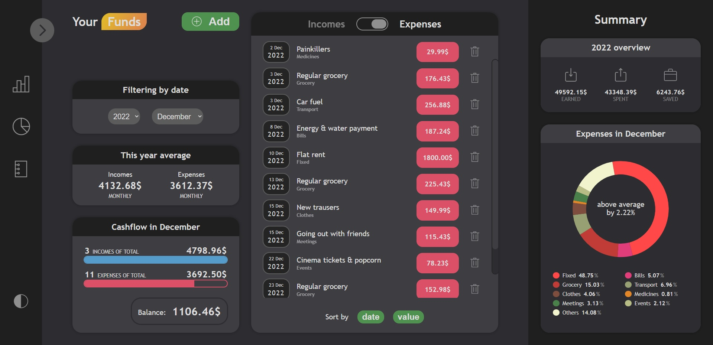
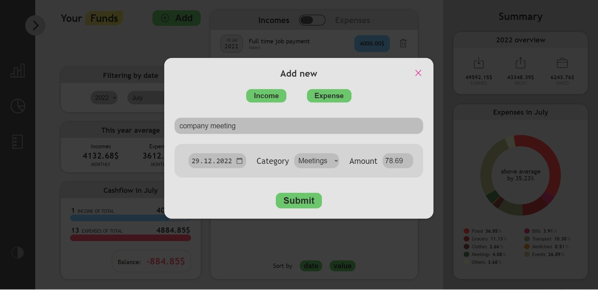
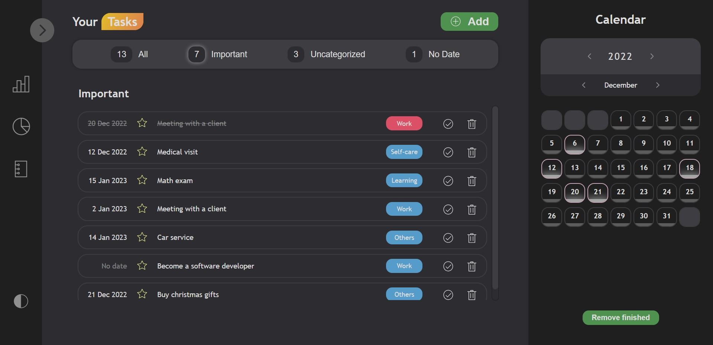

# Strictly task & finance Manager

## Table of contents

- [General info](#general-info)
- [Preview](#preview)
- [Technologies](#technologies)
- [Setup](#setup)

## General info

This project grew up pretty quickly from just another React learning process summary to a quite complex application, even though it doesn't connect with a database and storing it's state locally in web browser memory.

It allows users to take control of their finances with tracking every income and expense, as well as scheduling things to do or to remember about. Starting with 'funds' section, it's divided to two boards, let call it like that, with a couple of widgets containing numeric or graphical representation of different data, like current month cashflow, year averages and expenses pie chart. Next to these, of course page includes list of actual incomes or expenses, that gaves the user ability to sort those by value and date or deleting particular elements.

On the other hand, 'tasks' section offers the list of goals, divided into categories, with a functionality of sorting elements by priority level, having no category and no date. Interactive calendar on the right helps the user to locate tasks in time. Every element may be set as 'done', and these can be deleted as a whole.

At the end of the process I've already known that not everything was written the best way, but for now I'd like to keep it public just to not fall into infinite loop of upgrades, refactors etc. what is kinda obvious while studying and increasing skills.

Live demo: https://peaceful-manatee-8aee90.netlify.app

## Preview





## Technologies

Project is created with:

- React (hooks, context API, portals)
- ES6+ code standard
- CSS modules

The data is stored in localStorage, there're also pre-defined arrays of objects that are loaded the first time the page is opened on the device, so no need to add incomes, expenses and tasks by yourself.

## Setup

To run this project, clone repository and install it locally using npm:

```
$ npm install
$ npm start
```

or yarn:

```
$ yarn install
$ yarn start
```
